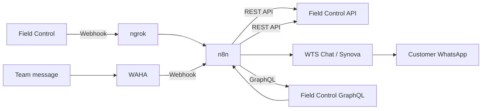

# Field Control + WhatsApp Automation with n8n

[](#11-project-context)
[](https://n8n.io/)
[](https://www.docker.com/)
[](https://developer.mozilla.org/docs/Web/JavaScript)
[](https://www.whatsapp.com/)

[Português](README.md) | **English**

Real-world integration project connecting [**Field Control**](https://fieldcontrol.com.br/), a field service management platform, with **WhatsApp**, using **n8n** as the automation and orchestration layer.

The solution was developed for a technical assistance company to automate customer communication during service operations, reducing repetitive manual work and improving the consistency of service updates.

> **Status:** COMPLETED
>
> **Implementation period:** June 4–17, 2026.
>
> **Repository scope:** technical case study and implementation reference. The original n8n workflow is no longer available for import.

## Table of contents

- [1. Overview](#1-overview)
- [2. What was automated](#2-what-was-automated)
- [3. Architecture](#3-architecture)
- [4. Stack](#4-stack)
- [5. Workflow structure](#5-workflow-structure)
- [6. Implemented automations](#6-implemented-automations)
- [7. Technical findings](#7-technical-findings)
- [8. Results](#8-results)
- [9. Repository scope](#9-repository-scope)
- [10. Security and privacy](#10-security-and-privacy)
- [11. Project context](#11-project-context)
- [12. Known limitations](#12-known-limitations)

---

## 1. Overview

Field technicians used Field Control to manage service activities, while customer communication was handled separately through WhatsApp.

Because the systems were not integrated, several routine actions required manual work. After a service visit, for example, someone from the team had to retrieve the report link, locate the customer's contact information, and send the message manually.

The integration was created to automate communication at key points of the service workflow.

At the time of implementation, the operation handled approximately **228 completed service activities per month**.

---

## 2. What was automated

| Operational event | Automated action |
|---|---|
| Service activity completed | The customer receives the service report link through WhatsApp |
| Quotation created | The customer receives the quotation link and signing instructions |
| Technician traveling | The tracking link is processed through WAHA and Field Control GraphQL and sent to the customer |

All three automations were completed and used in the project.

The technician tracking flow required a different approach because the data needed to associate the public tracking link with the correct service activity was not available through the same REST endpoints used by the other workflows.

---

## 3. Architecture

**n8n** acted as the central integration layer: it received events, processed payloads, queried APIs, and triggered WhatsApp messages.



Functionally, the project had two main paths:

```text
Field Control
    → webhook
    → ngrok
    → n8n
    → Field Control REST API
    → WTS Chat / Synova
    → Customer WhatsApp
```

```text
Tracking message
    → WAHA
    → webhook
    → n8n
    → Field Control GraphQL
    → Field Control REST API
    → Customer WhatsApp
```

---

## 4. Stack

| Technology | Role in the project |
|---|---|
| **[n8n](https://n8n.io/)** | Self-hosted automation and orchestration |
| **[Docker](https://www.docker.com/)** | Containerized service execution |
| **[ngrok](https://ngrok.com/)** | Public endpoint for incoming webhooks |
| **[WAHA](https://waha.devlike.pro/)** | Self-hosted WhatsApp HTTP API for incoming messages |
| **Field Control REST API** | Service orders, customers, and activities |
| **Field Control GraphQL** | Data resolution for technician tracking |
| **WTS Chat / Synova CRM** | WhatsApp message delivery |
| **JavaScript** | Data processing inside n8n `Code` nodes |
| **Webhooks** | Event-driven communication between systems |

---

## 5. Workflow structure

### 5.1 Field Control webhook

The same webhook received Field Control events, and a `Switch` routed processing according to the `x-fieldcontrol-event` header.

```text
Webhook
    └── Switch (x-fieldcontrol-event)
            │
            ├── task-completed
            │       └── process orderId
            │               └── retrieve service order
            │                       └── retrieve customer
            │                               └── send service report
            │
            └── quotation-created
                    └── process quotation data
                            └── retrieve customer
                                    └── send quotation
                                            └── send signing instructions
```

### 5.2 WAHA webhook

The tracking flow received the relevant message through WAHA and followed a resolution chain until the correct customer was identified.

```text
Webhook
    └── filter relevant messages
            └── extract trackingId
                    └── GraphQL request
                            └── decode returned token
                                    └── retrieve activity
                                            └── retrieve service order
                                                    └── retrieve customer
                                                            └── send tracking link
```

---

## 6. Implemented automations

### 6.1 Service report

When a technician completed a service activity in Field Control, a `task-completed` event was sent to n8n.

The workflow:

1. received the Field Control event;
2. extracted the service order identifier;
3. retrieved the service order through the REST API;
4. retrieved the associated customer;
5. obtained the customer's phone number;
6. sent the service report link through WhatsApp.

```text
Technician completes activity
        ↓
Field Control webhook
        ↓
n8n
        ↓
Service order
        ↓
Customer
        ↓
WhatsApp message
```

This removed the need for the support team to manually locate and send each service report after a visit.

### 6.2 Quotation

When a quotation was created, Field Control generated a `quotation-created` event.

The workflow:

1. received the webhook;
2. processed the quotation identifier;
3. retrieved the customer information;
4. generated the quotation link;
5. sent the link through WhatsApp;
6. sent additional signing instructions.

Unlike the completed-activity payload, the quotation event already provided the customer identifier directly, reducing the number of required API calls.

### 6.3 Technician tracking

Technician tracking required a different solution.

The information needed to associate the public tracking link with the corresponding service activity was not available through the same REST endpoints used by the other workflows.

The adopted approach used **WAHA** to receive the relevant WhatsApp message and extract the `trackingId`.

The workflow then used Field Control's GraphQL interface to resolve that identifier and obtain the information required to locate the corresponding activity.

```text
Tracking message
        ↓
WAHA
        ↓
n8n
        ↓
Extract trackingId
        ↓
GraphQL
        ↓
Decode token
        ↓
Activity
        ↓
Service order
        ↓
Customer
        ↓
WhatsApp
```

---

## 7. Technical findings

### 7.1 Base64-encoded IDs

Some Field Control identifiers were provided as Base64-encoded values containing more than one piece of information.

The `order.id`, for example, could be decoded into a structure similar to:

```text
uuid:accountId
```

The real service order identifier could then be extracted:

```javascript
const decoded = Buffer.from(id, 'base64').toString('utf-8');
const realId = decoded.split(':')[0];
```

### 7.2 Webhook header normalization

The Field Control event header reached n8n in lowercase:

```text
x-fieldcontrol-event
```

rather than:

```text
X-FieldControl-Event
```

Therefore, the `Switch` node responsible for routing events had to use the normalized header name.

### 7.3 Production payloads differed from test payloads

Some values observed in real events were located inside:

```javascript
$json.body
```

instead of directly at the root of the payload.

The workflows were adjusted after inspecting real events during implementation.

### 7.4 Tracking data through GraphQL

The tracking workflow used a GraphQL query to resolve a `trackingId` into a token containing information about the corresponding service activity.

The token's encoded payload could be decoded in JavaScript:

```javascript
const payload = token.split('.')[1];

const data = JSON.parse(
  Buffer.from(payload, 'base64').toString('utf-8')
);
```

The resulting data provided the identifiers required to continue the flow and retrieve the related activity.

---

## 8. Results

The automation was implemented in an operation handling approximately **228 completed service activities per month**.

Before the integration, sending a service report manually took approximately **1–2 minutes per completed activity**.

For service reports alone, this represented an estimated:

**4–8 hours of repetitive manual work per month.**

The project:

- automated service report delivery after completed visits;
- automated quotation notifications;
- automated quotation signing instructions;
- automated technician tracking delivery;
- reduced repetitive manual messaging;
- reduced the risk of forgotten messages;
- reduced the risk of sending information to the wrong contact;
- allowed customers to receive information shortly after relevant service events;
- connected independent systems through webhooks, REST APIs, and GraphQL.

---

## 9. Repository scope

This repository documents the architecture and implementation of the original project.

The n8n workflow ran in a self-hosted environment. The original workflow file was later lost when the development machine was reformatted without a backup of the n8n data volume.

The workflow structure, technical decisions, implementation details, and findings from the project were preserved in documentation.

> **Note:** this repository should be considered a **technical case study and implementation reference**, not a ready-to-import n8n package.

---

## 10. Security and privacy

Internal project documentation is not published because it contains operational and private information.

The public repository intentionally excludes:

- API keys and access tokens;
- production credentials;
- customer information;
- phone numbers;
- internal account identifiers;
- WhatsApp group identifiers;
- production webhook URLs.

Examples kept in the README are limited to the technical concepts required to explain the implementation.

---

## 11. Project context

This project was not created as a tutorial or academic exercise.

The integration was developed to solve an existing operational problem in a real technical assistance environment, connecting systems that previously worked independently and automating repetitive customer communication.

> **Status:** COMPLETED
>
> **Implementation period:** June 2026.

---

## 12. Known limitations

- the original environment was self-hosted on a local machine;
- availability depended on the host machine remaining online;
- a VPS or cloud environment would be more appropriate for continuous 24/7 operation;
- the WAHA Core edition used by the project had session limitations;
- free-tier infrastructure such as ngrok had usage limits;
- the integration depended on third-party APIs whose behavior could change over time;
- the original n8n workflow is no longer available in this repository.
