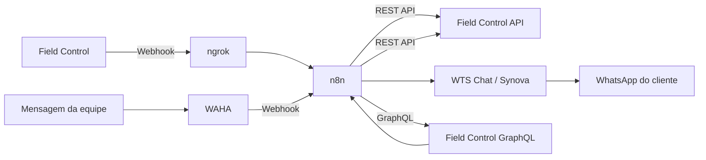

# Automação Field Control + WhatsApp com n8n

[](#11-contexto-do-projeto)
[](https://n8n.io/)
[](https://www.docker.com/)
[](https://developer.mozilla.org/docs/Web/JavaScript)
[](https://www.whatsapp.com/)

**Português** | [English](README.en.md)

Projeto real de integração entre o [**Field Control**](https://fieldcontrol.com.br/), plataforma de gestão de serviços em campo, e o **WhatsApp**, usando **n8n** como camada de automação e orquestração.

A solução foi desenvolvida para uma empresa de assistência técnica com o objetivo de automatizar comunicações com clientes durante a operação de atendimento, reduzindo trabalho manual repetitivo e aumentando a consistência das mensagens enviadas.

> **Status:** CONCLUÍDO
>
> **Período de implementação:** 4 a 17 de junho de 2026.
>
> **Escopo do repositório:** estudo de caso técnico e referência de implementação. O workflow original do n8n não está mais disponível para importação.

## Sumário

- [1. Visão geral](#1-visão-geral)
- [2. O que foi automatizado](#2-o-que-foi-automatizado)
- [3. Arquitetura](#3-arquitetura)
- [4. Stack](#4-stack)
- [5. Estrutura dos workflows](#5-estrutura-dos-workflows)
- [6. Automações implementadas](#6-automações-implementadas)
- [7. Descobertas técnicas](#7-descobertas-técnicas)
- [8. Resultados](#8-resultados)
- [9. Escopo do repositório](#9-escopo-do-repositório)
- [10. Segurança e privacidade](#10-segurança-e-privacidade)
- [11. Contexto do projeto](#11-contexto-do-projeto)
- [12. Limitações conhecidas](#12-limitações-conhecidas)
- [13. Licença](#13-licença)

---

## 1. Visão geral

Os técnicos utilizavam o Field Control para gerenciar atividades de serviço, enquanto a comunicação com os clientes era realizada separadamente pelo WhatsApp.

Como os sistemas não estavam integrados, várias ações rotineiras exigiam trabalho manual. Após uma visita técnica, por exemplo, alguém da equipe precisava localizar o relatório, encontrar os dados de contato do cliente e enviar a mensagem manualmente.

A integração foi criada para automatizar a comunicação em pontos importantes do fluxo de atendimento.

Na época da implementação, a operação registrava aproximadamente **228 atividades concluídas por mês**.

---

## 2. O que foi automatizado

| Evento operacional | Ação automática |
|---|---|
| Atividade de serviço concluída | O cliente recebe o link do relatório da visita pelo WhatsApp |
| Orçamento criado | O cliente recebe o link do orçamento e as instruções de assinatura |
| Técnico em deslocamento | O link de rastreamento é processado via WAHA e Field Control GraphQL e enviado ao cliente |

As três automações foram concluídas e utilizadas no projeto.

A automação de deslocamento exigiu uma abordagem diferente das demais porque os dados necessários para relacionar o link público de rastreamento à atividade correta não estavam disponíveis pelos mesmos endpoints REST usados nos outros fluxos.

---

## 3. Arquitetura

O **n8n** funcionava como a camada central de integração: recebia eventos, tratava payloads, consultava APIs e acionava o envio das mensagens no WhatsApp.



Em termos funcionais, existiam dois caminhos principais:

```text
Field Control
    → webhook
    → ngrok
    → n8n
    → Field Control REST API
    → WTS Chat / Synova
    → WhatsApp do cliente
```

```text
Mensagem de rastreamento
    → WAHA
    → webhook
    → n8n
    → Field Control GraphQL
    → Field Control REST API
    → WhatsApp do cliente
```

---

## 4. Stack

| Tecnologia | Função no projeto |
|---|---|
| **[n8n](https://n8n.io/)** | Automação e orquestração self-hosted |
| **[Docker](https://www.docker.com/)** | Execução dos serviços em containers |
| **[ngrok](https://ngrok.com/)** | Endpoint público para recebimento dos webhooks |
| **[WAHA](https://waha.devlike.pro/)** | API HTTP self-hosted para recebimento de mensagens do WhatsApp |
| **Field Control REST API** | Consulta de ordens de serviço, clientes e atividades |
| **Field Control GraphQL** | Resolução dos dados necessários ao fluxo de rastreamento |
| **WTS Chat / Synova CRM** | Envio das mensagens ao WhatsApp do cliente |
| **JavaScript** | Processamento de dados nos nós `Code` do n8n |
| **Webhooks** | Comunicação orientada a eventos entre os sistemas |

---

## 5. Estrutura dos workflows

### 5.1 Webhook do Field Control

O mesmo webhook recebia eventos do Field Control e um `Switch` direcionava o processamento conforme o header `x-fieldcontrol-event`.

```text
Webhook
    └── Switch (x-fieldcontrol-event)
            │
            ├── task-completed
            │       └── processa orderId
            │               └── consulta ordem de serviço
            │                       └── consulta cliente
            │                               └── envia relatório
            │
            └── quotation-created
                    └── processa dados do orçamento
                            └── consulta cliente
                                    └── envia orçamento
                                            └── envia instruções de assinatura
```

### 5.2 Webhook do WAHA

O fluxo de rastreamento recebia a mensagem relevante via WAHA e seguia uma cadeia de resolução até identificar o cliente correto.

```text
Webhook
    └── filtra mensagens relevantes
            └── extrai trackingId
                    └── consulta GraphQL
                            └── decodifica token retornado
                                    └── consulta atividade
                                            └── consulta ordem de serviço
                                                    └── consulta cliente
                                                            └── envia rastreamento
```

---

## 6. Automações implementadas

### 6.1 Relatório de visita

Quando um técnico concluía uma atividade no Field Control, o evento `task-completed` era enviado ao n8n.

O workflow:

1. recebia o evento do Field Control;
2. extraía o identificador da ordem de serviço;
3. consultava a ordem pela REST API;
4. recuperava o cliente associado;
5. obtinha o telefone do cliente;
6. enviava o link do relatório pelo WhatsApp.

```text
Técnico conclui a atividade
        ↓
Field Control envia webhook
        ↓
n8n
        ↓
Ordem de serviço
        ↓
Cliente
        ↓
Mensagem no WhatsApp
```

Esse fluxo eliminava a necessidade de a equipe localizar e enviar manualmente cada relatório após a visita.

### 6.2 Orçamento

Quando um orçamento era criado, o Field Control gerava o evento `quotation-created`.

O workflow:

1. recebia o webhook;
2. processava o identificador do orçamento;
3. recuperava os dados do cliente;
4. montava o link do orçamento;
5. enviava o link pelo WhatsApp;
6. enviava instruções adicionais de assinatura.

Diferentemente do payload de atividade concluída, o evento de orçamento já fornecia diretamente o identificador do cliente, reduzindo o número de chamadas necessárias à API.

### 6.3 Rastreamento do técnico

O rastreamento exigiu uma solução diferente.

A informação necessária para relacionar o link público de acompanhamento à atividade de serviço correspondente não estava disponível pelos mesmos endpoints REST utilizados nos outros workflows.

A solução adotada utilizou o **WAHA** para receber a mensagem relevante do WhatsApp e extrair o `trackingId`.

Em seguida, o workflow utilizava a interface GraphQL do Field Control para resolver esse identificador e obter os dados necessários para localizar a atividade correta.

```text
Mensagem com rastreamento
        ↓
WAHA
        ↓
n8n
        ↓
Extrai trackingId
        ↓
GraphQL
        ↓
Decodifica token
        ↓
Atividade
        ↓
Ordem de serviço
        ↓
Cliente
        ↓
WhatsApp
```

---

## 7. Descobertas técnicas

### 7.1 IDs codificados em Base64

Alguns identificadores do Field Control eram fornecidos em Base64 e continham mais de uma informação.

O `order.id`, por exemplo, podia ser decodificado em uma estrutura semelhante a:

```text
uuid:accountId
```

O identificador real da ordem de serviço podia então ser extraído:

```javascript
const decoded = Buffer.from(id, 'base64').toString('utf-8');
const realId = decoded.split(':')[0];
```

### 7.2 Normalização dos headers do webhook

O header do evento do Field Control chegava ao n8n em minúsculas:

```text
x-fieldcontrol-event
```

e não como:

```text
X-FieldControl-Event
```

Por isso, o nó `Switch` responsável pelo roteamento precisava utilizar o nome normalizado.

### 7.3 Payloads de produção diferiam dos payloads de teste

Alguns valores observados nos eventos reais estavam dentro de:

```javascript
$json.body
```

em vez de aparecerem diretamente na raiz do payload.

Os workflows foram ajustados após a inspeção dos eventos reais durante a implementação.

### 7.4 Dados de rastreamento via GraphQL

O fluxo de rastreamento usava uma consulta GraphQL para resolver um `trackingId` em um token contendo informações sobre a atividade correspondente.

O payload codificado do token podia ser decodificado em JavaScript:

```javascript
const payload = token.split('.')[1];

const data = JSON.parse(
  Buffer.from(payload, 'base64').toString('utf-8')
);
```

Os dados resultantes forneciam os identificadores necessários para continuar o fluxo e consultar a atividade relacionada.

---

## 8. Resultados

A automação foi implementada em uma operação com aproximadamente **228 atividades concluídas por mês**.

Antes da integração, o envio manual de um relatório consumia aproximadamente **1 a 2 minutos por atividade concluída**.

Considerando apenas o envio dos relatórios, isso representava uma estimativa de:

**4 a 8 horas de trabalho manual repetitivo por mês.**

O projeto:

- automatizou o envio de relatórios após visitas concluídas;
- automatizou notificações de novos orçamentos;
- automatizou o envio das instruções de assinatura;
- automatizou o encaminhamento do rastreamento do técnico;
- reduziu mensagens manuais repetitivas;
- reduziu o risco de esquecimentos;
- reduziu o risco de envio de informações ao contato incorreto;
- permitiu que o cliente recebesse informações logo após eventos relevantes do atendimento;
- conectou sistemas independentes por meio de webhooks, APIs REST e GraphQL.

---

## 9. Escopo do repositório

Este repositório documenta a arquitetura e a implementação do projeto original.

O workflow do n8n rodava em um ambiente self-hosted. Posteriormente, o arquivo original do workflow foi perdido quando a máquina de desenvolvimento foi formatada sem um backup do volume de dados do n8n.

A estrutura dos workflows, as decisões técnicas, os detalhes de implementação e as descobertas realizadas durante o projeto foram preservados na documentação.

> **Observação:** este repositório deve ser considerado um **estudo de caso técnico e referência de implementação**, e não um pacote n8n pronto para importação.

---

## 10. Segurança e privacidade

A documentação interna do projeto não é publicada porque contém informações operacionais e privadas.

O repositório público exclui intencionalmente:

- API keys e tokens de acesso;
- credenciais de produção;
- dados de clientes;
- números de telefone;
- identificadores internos de contas;
- identificadores de grupos do WhatsApp;
- URLs reais de webhooks de produção.

Os exemplos mantidos no README se limitam aos conceitos técnicos necessários para explicar a implementação.

---

## 11. Contexto do projeto

Este projeto não foi criado como tutorial ou exercício acadêmico.

A integração foi desenvolvida para resolver um problema operacional real em uma empresa de assistência técnica, conectando sistemas que antes funcionavam de forma independente e automatizando comunicações repetitivas com clientes.

> **Status:** CONCLUÍDO
>
> **Período de implementação:** junho de 2026.

---

## 12. Limitações conhecidas

- o ambiente original era self-hosted em uma máquina local;
- a disponibilidade dependia de a máquina hospedeira permanecer ligada;
- uma VPS ou ambiente em nuvem seria mais adequado para operação contínua 24/7;
- o WAHA Core utilizado no projeto possuía limitações de sessão;
- serviços em camada gratuita, como o ngrok, possuíam limites de uso;
- a integração dependia de APIs de terceiros cujo comportamento poderia mudar com o tempo;
- o workflow original do n8n não está mais disponível neste repositório.
